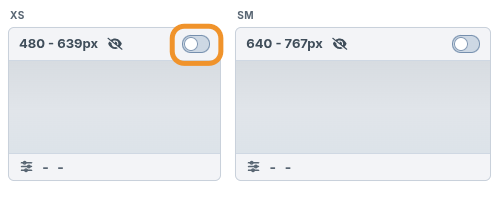

# Getting Started

Start in the template, not the control panel. Breakpoints gives you usable
responsive image markup immediately, so you can keep building the component with
a sensible placeholder ratio instead of stopping to configure transforms.

Once the layout has settled, process the page in the control panel.
Breakpoints measures the rendered image sizes, applies new transform sets
automatically, and lets you review or edit the final dimensions.

> Processing is intended for local development only, with the transform sets being
> committed to git.

## 1. Render a usable image

Call `image()` with the asset and a transform set name:

```twig
{{ image(entry.heroImage.one(), 'hero') }}
```
In this example, the image tag will use an existing transform set named `hero`,
or create a new set for it when processed.

Until a set exists for `hero`, Breakpoints uses the defaults unless you specify
init values.

```twig
{{ image(entry.heroImage.one(), 'hero', {
  initWidth: 1200,
  initRatio: "16:9",
  pictureClass: 'c-hero__picture',
  imgClass: 'c-hero__img'
}) }}
```

By using these init values you can leave the task of configuring breakpoint transforms until later. 

See the [`image()` reference](reference/twig-image-tag.md) for every option. For
setting system defaults, see
[Configuration](configuration.md).

## 2. Process and save the transform set

Once your component layout is ready, process the page to measure the
real rendered image sizes.

1. Open **Breakpoints → Transform Sets** and choose the entry with the image(s) to process.

   

2. Once processing is complete, any new image transform sets will be applied and saved automatically. If there are any new sets, processing is run again to verify the applied dimensions haven't drifted.

   

If front-end image layout is not stable, dimensions can drift between processing runs.

Image transforms should support the component layout, not define it. Use CSS
constraints such as `width`, `max-width`, `aspect-ratio`, or grid/flex rules to
hold the image in the intended space as its generated dimensions change.

> Processing goes as fast as transforms are generated. Some initial runs can take a while and depends on your set up.

> Breakpoints disables Craft template caching during processing,
> but it cannot bypass full-page caches such as Blitz or static caching. Turn
> those off locally while processing. See
> [Responsive Images → Caching During Processing](responsive-images.md#caching-during-processing).

## 3. Review and edit saved transform sets

The default Transform Sets view shows saved transform sets in a non-editing
state, so you can review the current dimensions and settings without changing
anything by accident.

To make changes, enable the edit toggle, then update the saved set values as
needed. Edits are saved automatically.

   

Editing is only available when `allowTransformEditing` is enabled in
`config/breakpoints.php`. Keep that enabled for local development only. See
[Configuration](configuration.md#sample-configbreakpointsphp).

## 4. Hidden breakpoints

If an image is not visible at a breakpoint during processing, Breakpoints
automatically disables that breakpoint for the saved transform set.
Visibility is based on the browser's rendered layout box for the image:
Breakpoints treats it as visible when the processed `` has a non-zero
`offsetWidth` or `offsetHeight`.

   

Front-end output still includes a source for the disabled breakpoint, but parks
it with a blank SVG placeholder. That prevents the browser from downloading an
image that is not needed for that layout.

## 5. Collapse the breakpoint view

The Transform Sets view shows breakpoints as relatively sized screen and image
representations. That makes the saved sizes easier to understand visually, but
it takes up a fair amount of space and usually requires horizontal scrolling to
view every set breakpoint.

Use the **Hide previews** toggle to collapse the view. Breakpoint columns switch
to fixed widths and asset previews are hidden, which makes it easier to scan an
entire transform set at once.

   
   


## Next steps

- [Configuration](configuration.md) — settings and the config file.
- [Custom Image Templates](custom-templates.md) — custom markup, LQIP, and lazy-loading libraries.
- [Responsive Images](responsive-images.md) — how the output is assembled.
