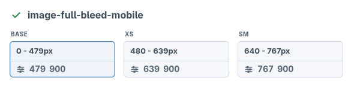
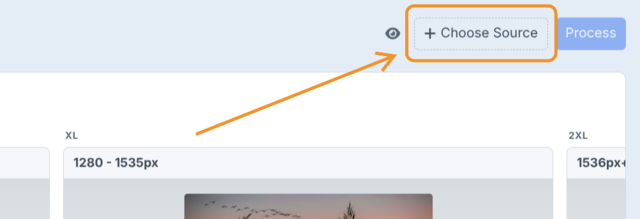
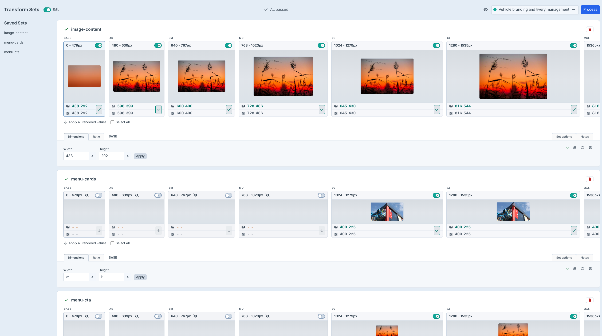
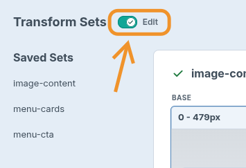
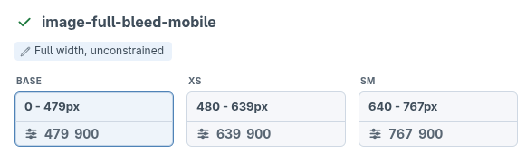
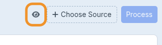
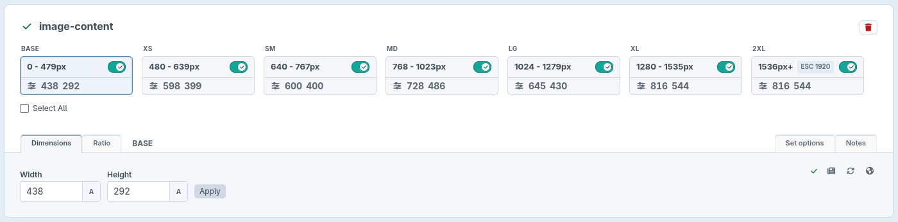

# Getting Started

Start in the template, not the control panel. Breakpoints gives you usable
responsive image markup immediately, so you can keep building the component with
a sensible placeholder ratio instead of stopping to configure transforms.

During development, when your layout has settled, process the page in the control panel.
Breakpoints measures the rendered image sizes, applies new transform sets
automatically, and lets you review or edit the final dimensions.

> Processing is intended for local development only, with the transform sets being
> committed to git.

## 1. How It Works

This plugin is designed to work with a mobile-first CSS framework such as Tailwind CSS.

Like Tailwind, things start with a base. Tailwind's base classes cover all screen sizes until a breakpoint is defined.

Breakpoints base image covers all screen sizes until a breakpoint is defined.

   


## 2. Render a usable image

Call `image()` with the asset and a transform set name:

```twig
{{ image(entry.heroImage.one(), 'hero') }}
```
In this example, the image tag will use an existing transform set named `hero`,
or create a new set for it when processed.

Until a set exists for `hero`, Breakpoints uses the defaults unless you specify
init values.

```twig
{{ image(entry.heroImage.one(), 'hero', {
  initWidth: 1200,
  initRatio: "16:9",
  pictureClass: 'c-hero__picture',
  imgClass: 'c-hero__img'
}) }}
```

By using these init values you can leave the task of configuring breakpoint transforms until later.

### Use different assets for selected slots

For art-directed images, pass `sources` when one `<picture>` should use
different Craft assets at different breakpoint slots.

```twig
{{ image(entry.desktopMasthead.one(), 'masthead', {
  priority: true,
  sources: {
    mobile: {
      asset: entry.mobileMasthead.one(),
      slots: ['base', 'xs'],
      quality: 65
    }
  }
}) }}
```

The first asset remains the default image and fallback ``. Any slot listed
in `sources.*.slots` uses that source asset instead. If a source asset is `null`,
Breakpoints ignores that source and uses the default image for those slots.
Optional source quality only affects that source's generated URLs and is not
saved to the transform set.

See the [`image()` reference](reference/twig-image-tag.md) for every option. For
setting system defaults, see
[Configuration](configuration.md).

## 3. Process and save the transform set

> **Important:** Configure the plugin breakpoints to match your CSS framework's breakpoints before processing. See [Configuration](configuration.md#sample-configbreakpointsphp).

Once your component layout is ready, process the page to measure the real rendered image sizes.

1. Open **Breakpoints → Transform Sets** and choose the entry with the image(s) to process.

   

2. Once processing is complete, any new image transform sets will be applied and saved automatically. If new sets were created, processing runs again automatically to verify the applied dimensions haven't drifted.

   

If front-end image layout is not stable, dimensions can drift between processing runs.

Image transforms should support the component layout, not define it. Use CSS
constraints such as `width`, `max-width`, `aspect-ratio`, or grid/flex rules to
hold the image in the intended space as its generated dimensions change.

> Processing goes as fast as transforms are generated. Some initial runs can take a while and depends on your set up.

> Breakpoints disables Craft template caching during processing,
> but it cannot bypass full-page caches such as Blitz or static caching. Turn
> those off locally while processing. See
> [Responsive Images → Caching During Processing](responsive-images.md#caching-during-processing).

## 4. Review processing warnings

After processing, review any transform cards marked as needing attention before
you treat the saved values as final.

Warnings can appear when a transform set is missing, when enabled breakpoint
values are empty, or when the rendered image sizes no longer match the saved
transform dimensions.

Resolve the warning shown on the card, then process the entry again to verify
the updated values. A clean run should show no warnings detected.

### Empty Enabled Breakpoints

Enabled breakpoint rows need a saved width or height. If a breakpoint is enabled
but both values are empty, add the missing dimensions or disable that breakpoint
if the component should not generate an image there.

Images that are truly not visible when processed have a width and height of zero and are automatically disabled when sets are saved. If you enable one of these, you will see this warning.

### Mismatched Assets

Transform set not producing consistent measured sizes.

Transform sets can be reused across templates, so every use of the same set
handle should render at the same dimensions.

When processing finds multiple assets using the same set handle, those assets
are grouped together in the transform set card. 

You can use the pagination to view the different assets and find the mismatch.

This might require some layout/CSS changes to fix the front-end inconsistency or separating use cases by creating new transform set handles.

### Breakpoint Mismatch

After processing, Breakpoints compares the latest rendered image sizes with the
saved transform dimensions. 

Mismatches usually mean the front-end was changed and the transform set needs updated.


## 5. Review and edit saved transform sets

The default Transform Sets view shows saved transform sets in a non-editing
state, so you can review the current dimensions and settings without changing
anything by accident.

To make changes, enable the edit toggle, then update the saved set values as
needed. Edits are saved automatically.

   

Editing is only available when `allowTransformEditing` is enabled in
`config/breakpoints.php`. Keep that enabled for local development only. See
[Configuration](configuration.md#sample-configbreakpointsphp).

## Set options

### Allow height differences

This provides height warning rules for when an expected height-only mismatch
should not block review.

This is useful for image areas whose rendered height is affected by content,
such as background-style images. Other team members may process the same
transform set with different content and get height warnings unless the set
allows that variation.

Auto height is different: it lets each image keep its intrinsic ratio. These
options keep the saved transform height, but relax review warnings when the
rendered height is expected to vary.

Two settings are available:

- **Allow Shorter heights** accepts a rendered height that is less than or
  equal to the saved height. A taller rendered image is still reported as a
  mismatch.
- **Allow Any Height** accepts every rendered height and prevents height alone
  from causing a mismatch.

Only one height setting can be active at a time.

### Allow Hidden During Processing

This is a separate setting for transform sets
whose image is hidden on page load in normal use, such as navigation card
images that only appear on interaction. Processing requires the image to be
visible, so you'd normally intervene to force it visible, process it, then
revert the intervention — after which re-processing would flag the set as a
mismatch because the image is hidden again. Enabling this setting prevents
that false mismatch.

## Notes

### Add notes to a transform set

Use the **Notes** tab to record information that should stay with a transform
set, such as its intended component, layout constraints, unusual dimensions,
or decisions made while reviewing processing results.

Enter the note and select **Save notes**. Saved notes are shown on the transform
card so they are visible when the set is reviewed later.

   


## Collapse the breakpoint view

The Transform Sets view shows breakpoints as relatively sized screen and image
representations. That makes the saved sizes easier to understand visually, but
it takes up a fair amount of space and usually requires horizontal scrolling to
view every set breakpoint.

Use the **Hide previews** toggle to collapse the view. Breakpoint columns switch
to fixed widths and asset previews are hidden, which makes it easier to scan an
entire transform set at once.

   
   


## Next steps

- [Configuration](configuration.md) — settings and the config file.
- [Custom Image Templates](custom-templates.md) — custom markup, LQIP, and lazysizes.
- [Responsive Images](responsive-images.md) — how the output is assembled.
